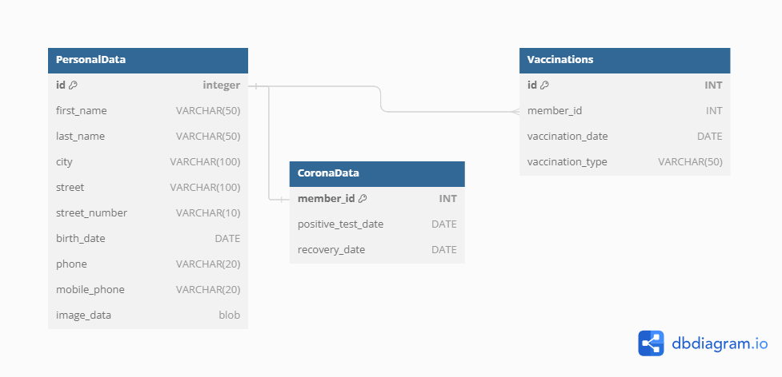
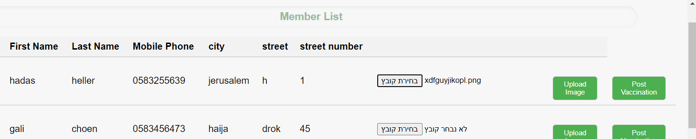
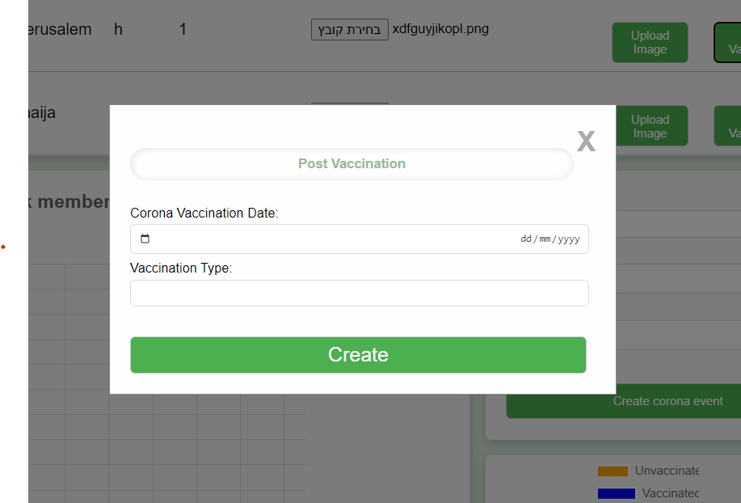
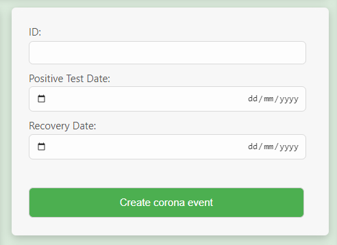
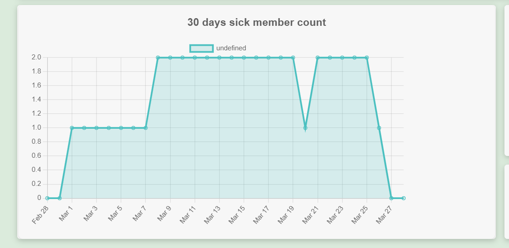
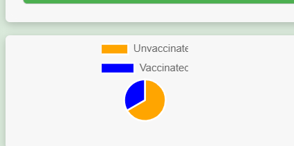
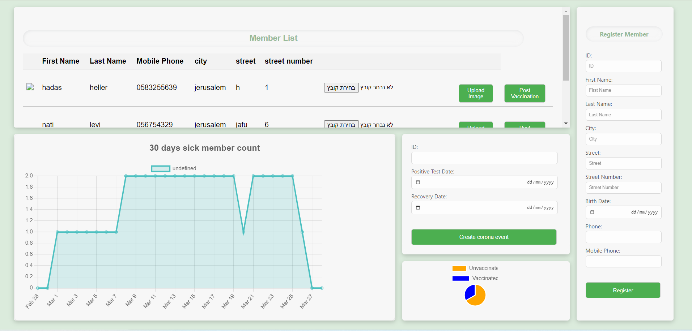

# ex1 TwitterTower
- I used c#. the code is in the file TwitterTower.cs (if you cant execute it this is my git repository to the ex1 https://github.com/hadashellergit/hadas_heller_213570302_ex1)

# ex2 COVID management 

## Overview

The system architecture follows a Model-View-Controller (MVC) pattern, where the application is divided into three main components: models, views, and controllers. Additionally, services are used to encapsulate business logic and interact with models.

## Folder Structure

My project has the following folder structure:

- **server**: Contains the backend code written in Node.js.
  - **controllers**: Contains the controller logic for handling HTTP requests.
  - **models**: Contains the data models representing the database schema.
  - **routes**: Contains the routing logic to map HTTP requests to controller actions.
  - **uploads**: Used to store uploaded files.
  - **config**: Contains the db.js.
  - **services**: Contains the business logic encapsulated in service modules - because the app was very simple the services in the app dont do much. i added this layer to create a strong foundation to the project.
- **client**: Contains the frontend code written in React.

## Database  
###### remember that the id fields are FOREIGN KEY with refernce to the member id 
- **personaldata**: Stores information about members, including their personal details and uploaded images.
- **coronadata**: Stores data related to COVID-19 tests and recovery dates for members.
- **vaccinations**: Records vaccination details for members.

## Development Tools and Technologies

- **Node.js**: Used for building the server-side logic.
- **Express.js**: Provides a framework for building RESTful APIs in Node.js.
- **React**: Used for building the frontend user interface.
- **MySQL**: The chosen relational database management system for storing application data.

## api/
- http://localhost:3001/api/corona/coronaEvent -  POST a positive date and id and an optinal recovery date (the route map the http request and to the requiered controller);
- http://localhost:3001/api/corona/getCoronaChartData - GET an object with the fileds date and count (...) 
- http://localhost:3001/api/member/getAllMembers - GET all the row from personal data table (...)
- http://localhost:3001/api/member/:id - GET member object that has the given id (...)
- http://localhost:3001/api/member/uploadImage - POST the img in as blob objevt in table (...)
- http://localhost:3001/api/vaccinations/createVaccination - POST vaccine data (...)
- http://localhost:3001/api/member/createMember - POST new member in to the members table (...)
- http://localhost:3001/api/member/getAllMembers - GET a list of all of the members in the HMO (...)
- http://localhost:3001/api/vaccinations/unVaccinatedMembersCounter - GET the count of hmo members that didnt had any vaccin (...)
## database diagram

## in order to get started run the sql query (in createDataBase.sql) in the server terminal , then run ` node server.js` in the server and `npm start` in the client
- (after installing)
**installed in terminal**
- npm install mysql
- npm install express
- npm install axios
- npm install cors
- npm install mysql@latest
- npm install helmet
- npm install morgan
- npm install multer
- npm install axios
- npm install react-chartjs-2 chart.js
- npm install chartjs-adapter-date-fns
- npm install react-scripts

## the member list is displayed with the user data and two options, uplaoding img or posting a vaccination 

 
 ## vaccination data wimdow will apear for user to use

## post corona data positive test date and recovery (or positve test date with no recovery date)

## graph display with the count of sick patients for the past 30 days

## and a pie chart of the un vaccinated members out of the members

## the complit dashboard

# ex2 part 2.1 and 2.2 is in the RequiermenetsRviewQA.pdf 

